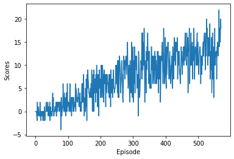

##### **Udacity Deep Reinforcement Learning Nanodegree**
# Project 1: Navigation
This file provides a detailed report of training a DQN-Agent from scratch to solve the Navigation  environment.

## **Learning Algorithm**
We have used the **Deep Q Learning** algorithm to train an agent to solve the environment. 

In **Q Learning** algorithm we maintain a table, called the **Q Table**, which stores the expected reward of each action at every state. The agent then select only the actions at every state which results in the **maximum expected reward**.

This will work very well in case of environments with very small state and action space. But in case of environments with very large state space and action space this method will create a problem as the amount of memory required to store the Q Table will be very large. 

To solve this problem we use **Deep Q Learning** algorithm in which we train a deep neural network model to **estimate the expected reward** of each action at any state.

In this algorithm we use **two separate networks** for learning. One network called the **Local Network** is the actual network which is learning the parameters at every step. Another called the **Target Network** is used to estimate the target value. The target network is updated and frozen with the parameters of the local network after every certain number of steps. At every step we store the experience tuple (which is a tuple of state, action, reward, next_state, done) in a buffer memory which is called the Replay Buffer. We select a random batch of experiences from the replay buffer and use that to train the agent at each step.

## **Implementation**
All the core classes related to the DQN Algorithm is implemented in the dqn module. Below as the detailed expalanation of individual modules and classes.

>### **Modules**
>**[storage](./dqn/storage.py)** module contains the implementation of the **ReplayBuffer**
>
>**[model](./dqn/model.py)** module contains the implementation of the **Q Network** class. The neural network is implemented using PyTorch.
>
>**[agent](./dqn/agent.py)** module implements the **Agent** class.

> ### **Classes**
> **[ReplayBuffer](./dqn/storage.py#L7)** This class contains methods to store and sample experience tuples.
> 
> **[QNetwork](./dqn/model.py#L6)** This class is the actual Q Network. It is used to create the Local and the Target network of the DQN Agent. For this project the architecture of the network is as follows.
> * The Input layer has shape of **(batch_size, state_size)**.
> * Activation function used is **ReLU**.
> * Hidden Layer 1 shape is **(state_size, fc1_units)**.
> * Activation function used is **ReLU**.
> * Hidden Layer 2 shape is **(fc1_units, fc2_units)**.
> * Activation function used is **ReLU**.
> * Output Layer has a shape of **(fc2_units, action_size)**.
> * No activation is used at the output layer.
>
> **[Agent](./dqn/agent.py#L9)** This class implements the DQN Agent. It has the Local and Target networks. It implements the methods to train the networks and select action based on the current policy.

> ### **Hyperparameters**
> Below are the Hyperparameters used to train the agent.
> * seed = 1
> * buffer_size = 100000
> * batch_size = 64
> * gamma = 0.99
> * tau = 1e-3
> * lr = 5e-4
> * update_every = 4
> * eps_start = 1.0
> * eps_end = 0.01
> * eps_decay = 0.995
> * n_episodes = 2000
> * max_t = 1000

## **Plots of Rewards**
Below is the plot of rewards during the training of the agent.
* Episode 100	Average Score: 0.476464646464646445
* Episode 200	Average Score: 3.44
* Episode 300	Average Score: 6.98
* Episode 400	Average Score: 9.59
* Episode 500	Average Score: 11.64
* Episode 571	Average Score: 13.03
* Environment solved in 471 episodes!	Average Score: 13.03

The agent was able to score an average of more than +13 over 100 episodes. 
The agent was able to solve the environment in 471 episodes with an average score of 13.03

## **Ideas for Future Work**
Currently we are using vanilla DQN Agent to solve the environment. In futur we have plans to implement several versions of the DQN algorithm like **Double DQN**, **Dueling DQN** and the **Rainbow**. Also we plan to use **Prioratized Experience Replay** method to improve the training process.